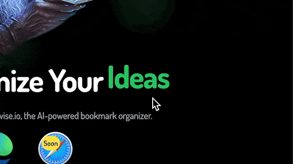

# Easy React Text Loop



easy-react-text-loop is a React component that allows you to easily create text loops with a nice fade animation.

[![module formats: umd, cjs, and esm][modules-badge]][size]

[![npm version][version-badge]][npm]
[![npm downloads][downloads-badge]][npm]
[![MIT License][license-badge]][license]
[![PRs Welcome][prs-badge]][prs]

---

## Installation

```bash
npm install --save easy-react-text-loop
```

or

```bash
yarn add easy-react-text-loop
```

or

```bash
pnpm add easy-react-text-loop
```

### Usage

```jsx
import { TextLoop } from "easy-react-text-loop";

const App = () => {
  return (
    <div>
      I will loop through these words:{" "}
      <TextLoop>
        <span>hello</span>
        <span>world</span>
        <span>everyone</span>
      </TextLoop>{" "}
      and then start again!
    </div>
  );
};
```

### Props

| Prop      | Type            | Default | Definition                                              |
| --------- | --------------- | ------- | ------------------------------------------------------- |
| interval  | number \| array | `2500`  | The frequency (in ms) that the words change.            |
| children  | node            |         | The words you want to loop (required)                   |
| animation | enum         | `spring`  | Animation type |

## Contributing

Please follow our
[contributing guidelines](https://github.com/josephgoksu/easy-react-text-loop/blob/main/CONTRIBUTING.md).

## License

[MIT](https://github.com/braposo/easy-react-text-loop/blob/master/LICENSE)

[npm]: https://www.npmjs.com/package/easy-react-text-loop
[license]: https://github.com/braposo/easy-react-text-loop/blob/master/LICENSE
[prs]: http://makeapullrequest.com
[size]: https://unpkg.com/easy-react-text-loop/dist/easy-react-text-loop.min.js
[version-badge]: https://img.shields.io/npm/v/easy-react-text-loop.svg?style=flat-square
[downloads-badge]: https://img.shields.io/npm/dm/easy-react-text-loop.svg?style=flat-square
[license-badge]: https://img.shields.io/npm/l/easy-react-text-loop.svg?style=flat-square
[modules-badge]: https://img.shields.io/badge/module%20formats-umd%2C%20cjs%2C%20esm-green.svg?style=flat-square
[prs-badge]: https://img.shields.io/badge/PRs-welcome-brightgreen.svg?style=flat-square
[codesandbox-badge]: https://codesandbox.io/static/img/play-codesandbox.svg
[codesandbox]: https://codesandbox.io/s/easy-react-text-loop-playground-br4q1

## Author

- [Joseph Goksu](https://josephgoksu.com/)

I inspired from **react-text-loop** and **easy-react-text-loop** and I wanted to make it easier to use. I hope you like it.
